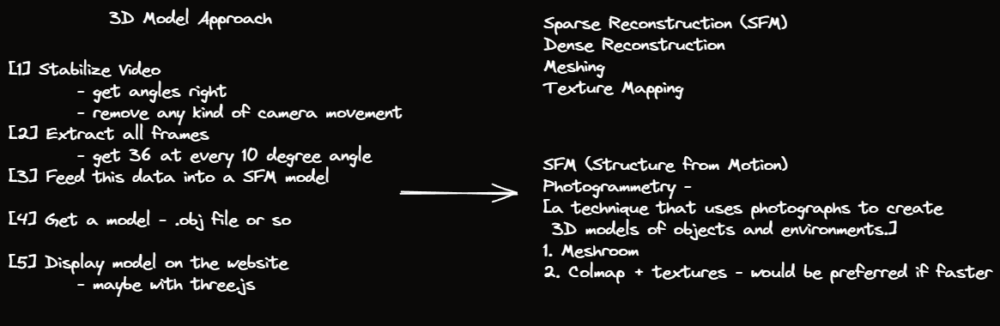

# rev-3d
A pipeline for converting 360° video into a 3D model.

### Dependencies:
- ffmpeg: `sudo apt install ffmpeg`

### High-level Architecture of the Approach


*Figure: High-level architecture*

### Directory Structure:
```bash
├── data        # data to be worked on
│   └── NissanMurano                    # name of the car - can be replaced with a unique ID
│       ├── unstable.mp4                # unstable video to be uploaded
│       ├── stable.mp4                  # video stabilized 
│       └── processed                   # a folder to store all the 36 extracted frames 
│           ├── img_1.png               # image at 0 degrees
│           └── img_36.png              # image at 360 degrees
├── notebooks   # houses ipynb files for research and comparing approaches
│   ├── 01_video_processing.ipynb
│   └── 02_extract_images.ipynb    
├── src             # core logic
│   ├── processor   # different directories for different functionalities 
│   ├── extractor 
│   └── main.py     # entrypoint
└── static      # static files
```
